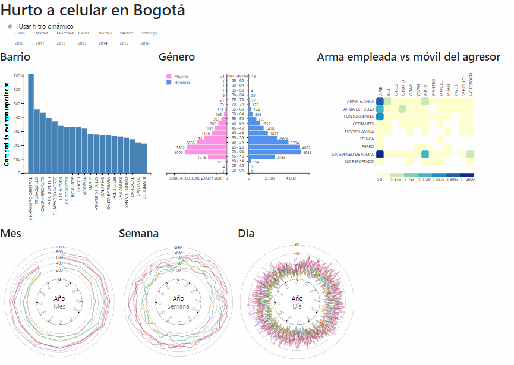

# Hurto de Celulares en la ciudad de Bogotá, Colombia
## Dashboard Interactivo - Análisis de 2010 a 2016

El hurto de celulares es un delito de alto impacto en la ciudad de Bogotá, el aumento en la cantidad de hurtos reportados
preocupa a las autoridades y a la población en general, sin embargo, la mayoría de la población desconoce las zonas en las que
más se presenta este delito, desconociendo variables de tiempo, modo y frecuencia de los eventos, dado el poco conocimiento de la
información y la poca divulgación por parte de las autoridades. Con datos oficiales de los hurtos a celular reportados entre los años
2010 a 2016 se propone una visualización tipo dashboard que permita presentar y descubrir insights que sean de uso público.

Desarrollado por [Jairo Ruiz Saenz](https://github.com/jairoruizsaenz), [Jofre Manchola](https://github.com/jofremanchola) y [Francisco Ariza](https://github.com/franciscoariza), Diciembre de 2017

Te invito a interactuar con la visualización, Visita el Demo [aquí](https://jairoruizsaenz.github.io/dashboard-hurto-celulares/).

